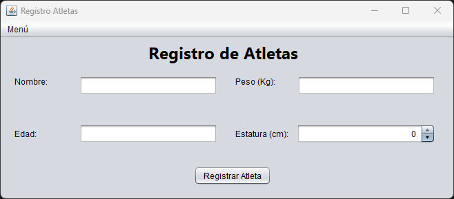
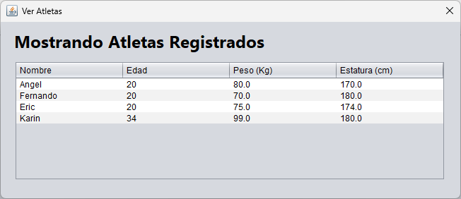

# Registro de Atletas en Java

## Descripción del Proyecto

El objetivo de este proyecto es desarrollar un software en Java para la inscripción de participantes en un concurso de atletismo. Los participantes podrán registrar sus datos personales, los cuales se almacenarán en un archivo binario.




## Campos a Registrar

- **Nombre**
- **Edad**
- **Peso (Kg)**
- **Estatura (cm)**

## Clases

1. `Atleta`
2. `AniadirBinario`
3. `VentanaMostrarAtletas`
4. `VentanaPrincipal`

## Componentes

- Menú para salir o ver los registros.
- Botón de regresar.
- Botón de guardar.

## Detalles de las Clases

### Clase `Atleta`

La clase `Atleta` define el objeto con los datos necesarios para cada atleta. Esta clase implementa la interfaz `Serializable` para que sus objetos puedan ser escritos en un archivo binario.

### Clase `ObjectOutputStreamReset`

Esta clase extiende `ObjectOutputStream` y se utiliza para evitar la duplicación de la cabecera del archivo binario cuando se añaden nuevos objetos.

```java
import java.io.File;
import java.io.IOException;
import java.io.ObjectOutputStream;
import java.io.OutputStream;

public class ObjectOutputStreamReset extends ObjectOutputStream {

    public ObjectOutputStreamReset(OutputStream out) throws IOException {
        super(out);
    }

    public ObjectOutputStreamReset() throws IOException, SecurityException {
    }

    @Override
    protected void writeStreamHeader() throws IOException {
        // Se usa este método tanto para escribir como para agregar elementos
        File archivo = new File("registroAtletas.bin");
        
        if (archivo.length() == 0) {  // Si el archivo está vacío
            // Usamos el método de la clase padre ObjectOutputStream
            super.writeStreamHeader();
        } else {
            // El archivo no está vacío
            reset();
        }
    }
}
```

### Clase `VentanaPrincipal`

Esta clase maneja la interfaz gráfica principal y la lógica para registrar nuevos atletas.

```java
import javax.swing.JOptionPane;
import java.io.FileOutputStream;
import java.io.ObjectOutputStreamReset;
import java.io.FileNotFoundException;
import java.io.IOException;

public class VentanaPrincipal {

    // Método para registrar atletas
    private void btnRegistrarActionPerformed(java.awt.event.ActionEvent evt) {
        try {
            String nombre = txtNombre.getText();
            int edad = Integer.parseInt(txtEdad.getText());
            float peso = Float.parseFloat(txtPeso.getText());
            float estatura = ((Number) spiEstatura.getValue()).floatValue();

            Atleta atleta = new Atleta(nombre, edad, peso, estatura);
            escribirBinario(atleta);

            // Limpiar los campos después de registrar
            txtNombre.setText("");
            txtEdad.setText("");
            txtPeso.setText("");
            spiEstatura.setValue(0);
        } catch (NumberFormatException ex) {
            JOptionPane.showMessageDialog(null, "Error: Debe ingresar datos válidos");
        } catch (Exception ex) {
            JOptionPane.showMessageDialog(null, "Ha ocurrido un error: " + ex);
        }
    }

    // Método para escribir en archivo binario
    private void escribirBinario(Atleta atleta) {
        try {
            FileOutputStream archivo = new FileOutputStream("registroAtletas.bin", true);
            ObjectOutputStreamReset escribir = new ObjectOutputStreamReset(archivo);
            escribir.writeObject(atleta);
            escribir.close();
        } catch (FileNotFoundException ex) {
            System.err.println("Error: " + ex);
        } catch (IOException ex) {
            System.err.println("Error: " + ex);
        }
    }
}
```

## Explicación de la Escritura de Objetos en Archivo Binario

Al escribir objetos en un archivo binario utilizando `ObjectOutputStream`, se añade una cabecera inicial al archivo. Esta cabecera es necesaria para identificar el archivo como un flujo de objetos, pero si se añaden más objetos al archivo posteriormente utilizando el mismo `ObjectOutputStream`, se vuelve a añadir la cabecera, lo que puede causar errores al leer el archivo.

En este proyecto, se utiliza una clase personalizada `ObjectOutputStreamReset` que extiende `ObjectOutputStream` y sobrescribe el método `writeStreamHeader()`. Esta clase comprueba si el archivo está vacío antes de escribir la cabecera. Si el archivo ya contiene datos, la cabecera no se vuelve a escribir, y en su lugar se utiliza el método `reset()` para mantener la integridad del archivo y permitir la adición de nuevos objetos sin problemas.

Con esta configuración, se asegura que los objetos se escriban correctamente en el archivo binario, y se pueden añadir más objetos posteriormente sin causar errores al leer el archivo.

## Autor

- [jangelmm](https://github.com/jangelmm)

## Licencia

En trámite